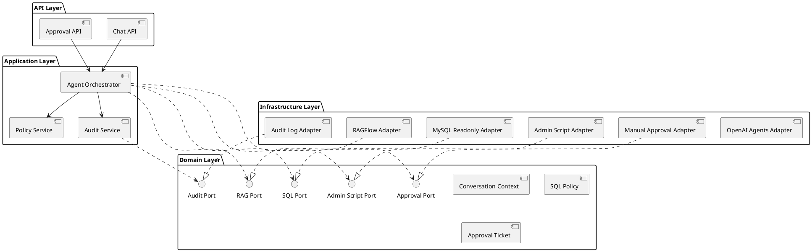
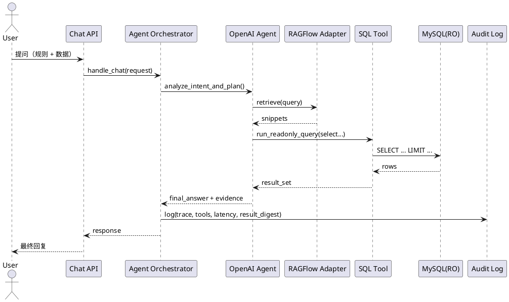
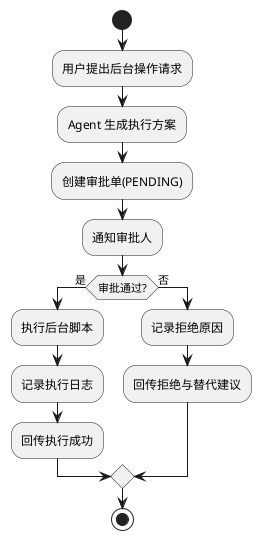

# OpenAI Agents SDK + RAGFlow 智能客服 Agent 架构设计

## 1. 文档目标与范围
- 目标：设计一个可落地的智能客服 Agent，基于 OpenAI Agents SDK 与 RAGFlow，支持制度问答、只读 SQL 查询、后台操作（人工确认后执行）。
- 范围：项目结构、核心组件职责、程序流转、风控与审计、UML 设计稿、MVP 实施边界。
- 非目标：不包含具体数据库建模细节、不包含前端页面设计、不包含多租户拆分实现。

## 2. 需求摘要（已确认）
- 部署形态：单体服务（MVP）。
- SQL 能力：只读（仅 `SELECT` / `EXPLAIN`）。
- 后台操作：默认人工确认后执行（审批流）。
- 已有资产：用户已具备可执行 SQL 查询与后台操作的 Python 脚本。

## 3. 架构原则
- 单一入口：所有用户请求统一进入编排层，由 Agent 决定调用路径。
- 六边形边界：业务用例通过 Port 接口调用外部依赖，避免业务逻辑与 SDK/API 强耦合。
- 安全优先：SQL 严格只读、后台脚本必须经过审批、全链路审计可追溯。
- 渐进增强：MVP 先单体，预留策略引擎与异步任务扩展点。

## 4. 总体架构（推荐方案）
推荐采用“轻量编排型 + 可插拔治理”：
- OpenAI Agents SDK 负责对话理解、专家分派、工具调用决策。
- RAGFlow 提供知识检索与上下文证据（制度、流程、规范）。
- SQL Tool 只读执行数据查询，返回结构化结果给 Agent 生成回复。
- Admin Script Tool 封装后台脚本调用，仅在审批通过后执行。
- Policy/Audit 作为横切能力，统一进行拦截、校验、记录、追踪。

### 4.1 逻辑分层
1. 接入层（API）
   - `Chat API`：接收用户问题、返回最终答复。
   - `Approval API`：供运营/管理员审批后台操作请求。

2. 应用层（Use Case / Orchestration）
   - `HandleChatUseCase`：主流程编排。
   - `RunSqlQueryUseCase`：只读 SQL 查询用例。
   - `RequestAdminActionUseCase`：创建审批单。
   - `ConfirmAdminActionUseCase`：审批后触发执行。

3. 领域层（Domain）
   - `ConversationContext`、`ToolCallIntent`、`ApprovalTicket` 等核心模型。
   - `SqlPolicy`、`ActionPolicy` 规则对象。
   - `Port` 接口：`RagPort`、`SqlPort`、`AdminScriptPort`、`ApprovalPort`、`AuditPort`。

4. 基础设施层（Adapters）
   - `OpenAIAgentsAdapter`、`RagflowAdapter`、`MysqlReadonlyAdapter`、`ScriptAdapter`。
   - `ManualApprovalAdapter`、`AuditLogAdapter`、`SQLiteSessionAdapter`。

## 5. 建议项目结构
```text
intelligent-cs-agent/
├── app/
│   ├── entrypoints/
│   │   ├── api/
│   │   │   ├── chat_controller.py
│   │   │   ├── approval_controller.py
│   │   │   └── health_controller.py
│   │   └── cli/
│   │       └── replay_session.py
│   ├── application/
│   │   ├── use_cases/
│   │   │   ├── handle_chat.py
│   │   │   ├── run_sql_query.py
│   │   │   ├── request_admin_action.py
│   │   │   └── confirm_admin_action.py
│   │   ├── dto/
│   │   └── services/
│   │       ├── agent_orchestrator.py
│   │       ├── policy_service.py
│   │       └── audit_service.py
│   ├── domain/
│   │   ├── models/
│   │   ├── policies/
│   │   └── ports/
│   ├── infrastructure/
│   │   ├── llm/openai_agents_adapter.py
│   │   ├── rag/ragflow_adapter.py
│   │   ├── db/mysql_readonly_adapter.py
│   │   ├── db/sqlite_session_adapter.py
│   │   ├── tools/sql_tool.py
│   │   ├── tools/admin_script_tool.py
│   │   ├── tools/tool_gateway.py
│   │   ├── approval/manual_approval_adapter.py
│   │   ├── audit/audit_log_adapter.py
│   │   └── config/settings.py
│   └── bootstrap/
│       ├── container.py
│       └── app_factory.py
├── scripts/
│   ├── sql_queries/
│   └── admin_ops/
├── docs/
│   └── uml/
│       ├── component.puml
│       ├── sequence_chat_sql.puml
│       └── activity_admin_approval.puml
├── tests/
│   ├── unit/
│   ├── integration/
│   └── e2e/
└── pyproject.toml
```

## 6. 程序流转设计
### 6.1 用户问答主流程
1. 用户请求到达 `Chat API`。
2. `HandleChatUseCase` 构建 `ConversationContext`（用户、会话、渠道、trace_id）。
3. `AgentOrchestrator` 调用 OpenAI Agent 进行意图识别和工具规划：
   - 制度/流程问题：调用 RAG 检索。
   - 数据问题：调用 SQL Tool（只读策略校验后执行）。
   - 操作请求：创建审批单，等待人工确认。
4. `PolicyService` 对每次工具调用做前置校验。
5. `AuditService` 记录全链路日志（请求、工具入参、结果、耗时、审批动作）。
6. 汇总结果并返回用户，附必要解释与风险提示。

### 6.2 SQL 查询流程（只读）
1. Agent 生成 SQL（或用户直传 SQL 请求）。
2. `SqlPolicy` 执行规则校验：
   - 仅允许 `SELECT` / `EXPLAIN`。
   - 禁止多语句与危险关键字组合。
   - 限制可访问库表白名单。
   - 设置超时、最大返回行数（默认分页）。
3. 通过 `MysqlReadonlyAdapter` 以只读账号执行。
4. 返回结构化结果给 Agent 生成自然语言答复。

### 6.3 后台操作流程（人工确认）
1. Agent 识别为后台操作请求（如退款、账号处理、工单推进）。
2. `RequestAdminActionUseCase` 生成 `ApprovalTicket(status=PENDING)`。
3. 审批方在 `Approval API` 执行同意/拒绝。
4. 同意后 `ConfirmAdminActionUseCase` 调用 `AdminScriptPort` 执行脚本。
5. 执行结果与审批动作均写入审计日志，再回传用户。

## 7. 安全、合规与可观测性
### 7.1 安全控制
- SQL 双重保护：应用层策略 + 数据库只读账户。
- Tool Gateway 强制收口：Agent 不允许直接访问 DB/OS。
- 后台脚本执行白名单：仅允许注册过的命令模板和参数。
- 审批防误触：高风险操作必须带审批意见、审批人标识、幂等键。

### 7.2 审计与追踪
- 审计字段：`trace_id`、`session_id`、`user_id`、`intent`、`tool_name`、`tool_input`、`tool_output_digest`、`approval_state`、`latency_ms`、`error_code`。
- 观测指标：成功率、平均延迟、工具调用失败率、审批通过率、SQL 命中率、RAG 召回命中率。

## 8. UML 设计（PlantUML）

### 8.1 组件图（Component Diagram）


### 8.2 时序图（Sequence Diagram：RAG + SQL 混合咨询）


### 8.3 活动图（Activity Diagram：后台操作审批）


## 9. 与现有 Demo 的映射建议
当前已有 `rag_sql_orchestration_demo.py`，建议按以下路径平滑演进：
- 保留：`RAGAgent` / `SQLAgent` / `Orchestrator` 三层编排思想。
- 增加：`ToolGateway`（统一拦截），把 `run_sql` 与后台脚本都挂到网关下。
- 升级：`run_sql` 的只读策略从“前缀判断”扩展为“规则对象 + 白名单 + 超时 + 限流”。
- 拆分：把单文件拆到 `application/domain/infrastructure` 分层目录。

## 10. MVP 里程碑
1. M1：对话 + RAGFlow 检索 + 会话持久化。
2. M2：只读 SQL Tool + 策略校验 + 审计日志。
3. M3：后台脚本审批流 + 执行回传。
4. M4：监控告警与失败降级策略。

## 11. 风险与缓解
- 风险：LLM 生成 SQL 不稳定。  
  缓解：SQL 模板化 + 规则校验 + 失败回退。
- 风险：后台操作误触发。  
  缓解：审批流 + 幂等控制 + 操作白名单。
- 风险：RAG 召回不准导致答非所问。  
  缓解：召回重排 + 引用证据强制输出 + 未命中兜底话术。

## 12. 验收标准（Definition of Done）
- 能区分并正确执行三类请求：RAG 问答、只读 SQL、后台操作审批。
- 所有工具调用具备可追溯审计记录与 `trace_id`。
- SQL 非只读请求可被拦截并返回可解释错误。
- 后台操作未审批不得执行。
- 至少通过 1 条 E2E 场景：混合咨询（RAG + SQL）和 1 条审批场景。
